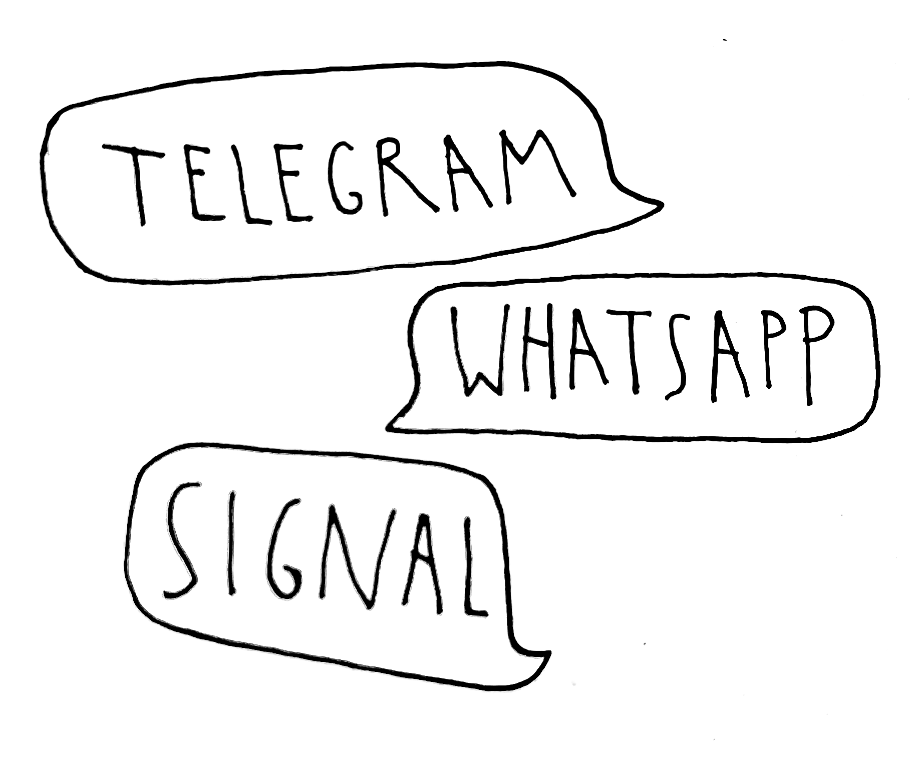

<p align="center">
  <picture>
    <source media="(prefers-color-scheme: dark)" srcset="art/wordmark-alpha-white.png">
    
  </picture>
</p>
<p align="center">
  All your Chats, finally, on the Light Phone III.
</p>

# Chats
A messaging tool for the Light Phone III. Connects all your chats, WhatsApp, Signal, Telegram, and more into one quiet, text-first interface. Log in with a [Beeper](https://beeper.com) account or a Matrix homeserver. Everything is end-to-end encrypted.

<p align="center">
  
</p>

## Features

- Connect to all your **Networks**, including WhatsApp, Signal, Telegram, Messenger, Google Messages, Instagram DMs and more, through your Beeper account
- 1:1 and group chats, with archive, pin, mute, search, reactions, delivery status support
- Notifications; a push channel delivers messages instantly
- Voice notes and photos
- Battery-conscious background sync, pausable from Settings
- End-to-end encrypted, with device verification

<p align="center">
  <br>
  <strong>End-to-end encrypted</strong>
</p>

## Install

The APK is signed with a development key, so it needs the community-ADB sideload route and the most permissive external-tools tier on the phone:

1. Download the latest APK from [Releases](https://github.com/fenleon/chats/releases/latest)
2. Enable USB debugging (Settings → Developer options) and install it: `adb install -r app-release.apk`
3. Set Developer options → External tools → **All tools**
4. Open Chats from the toolbox and log in with your Beeper account from Settings

## Build

```bash
tools/build --dir chats :app:assembleDebug      # from the workspace root
tools/build --dir chats :app:assembleRelease    # release (R8-minified)
```

The build consumes `../light-sdk` as a composite build; the SDK's chat service methods are additive patches carried in the workspace's fork of the SDK.

## Limitations

- Bridged networks (WhatsApp, Instagram, ...) arrive through Beeper, an unofficial path, not an official Meta client.
- Requires the **All tools** external-tools tier on a real Light Phone III (dev-signed APKs are treated as unknown by LightOS).
- Without a configured push endpoint, new messages arrive at the next scheduled sync round.

## Legal

Chats is an independent, unofficial open-source project, not affiliated with or endorsed by The Light Phone, Inc., or Beeper. The Matrix protocol engine is [Trixnity](https://github.com/benkuly/trixnity) (Apache-2.0). Licensed under the [MIT License](LICENSE).
