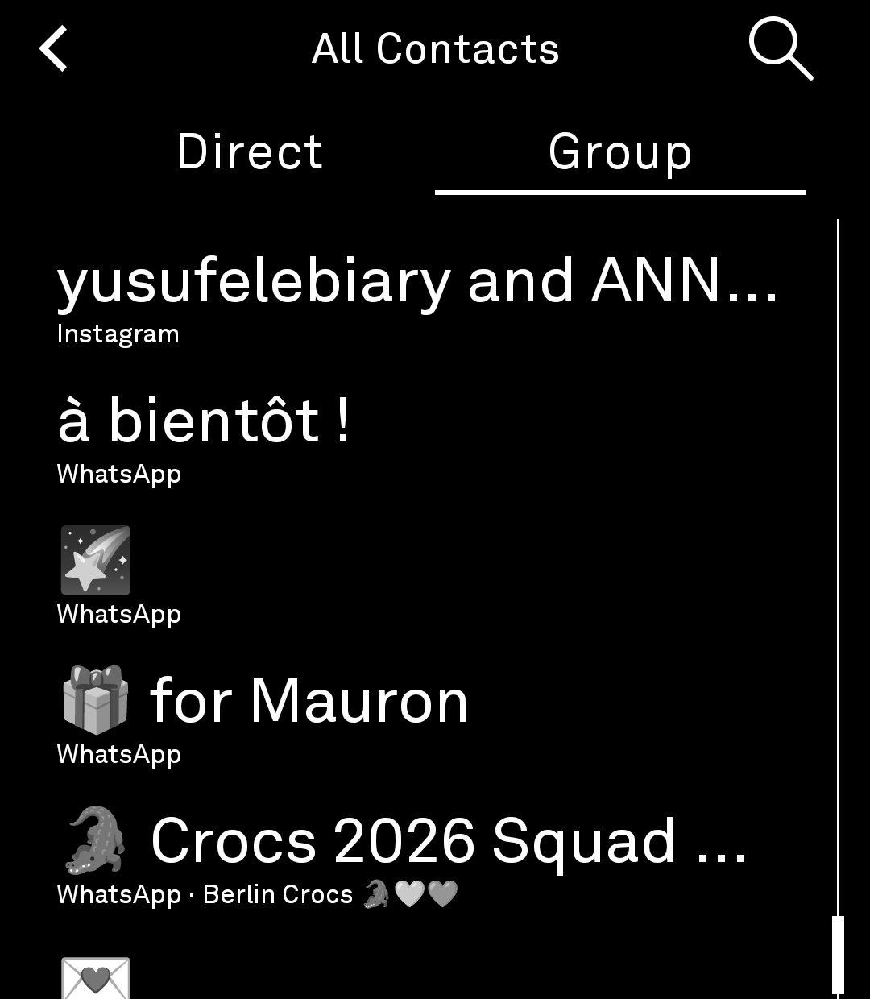
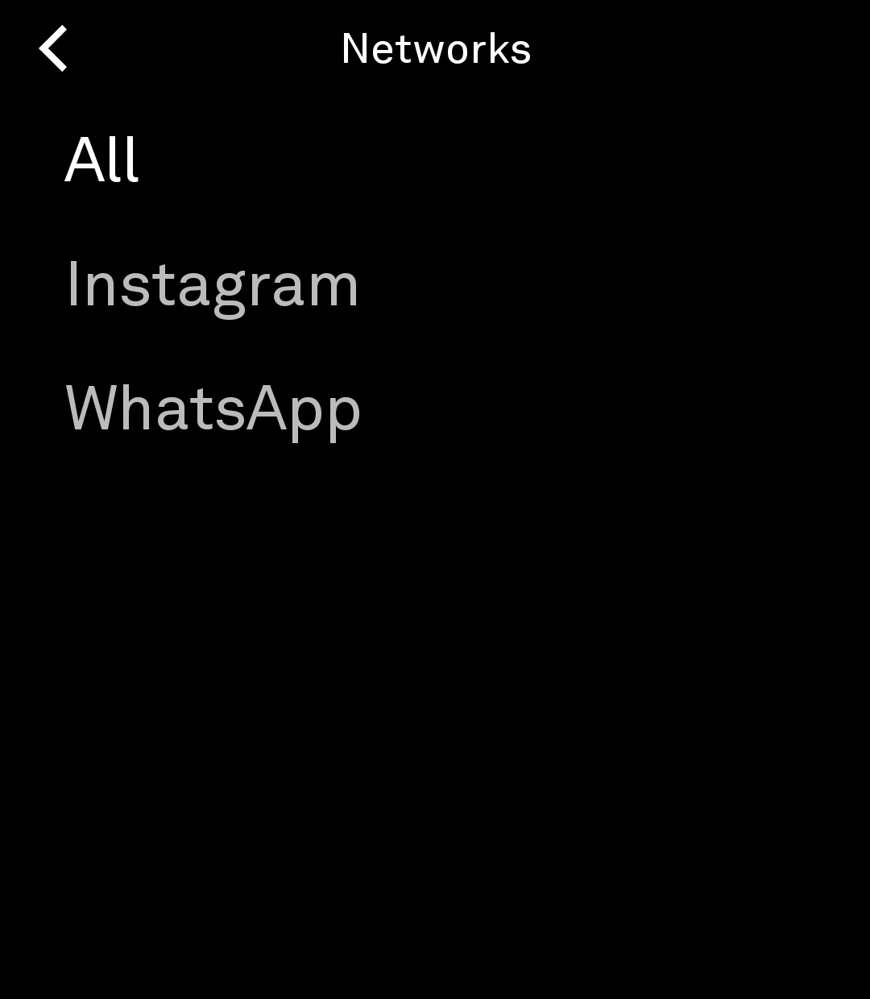
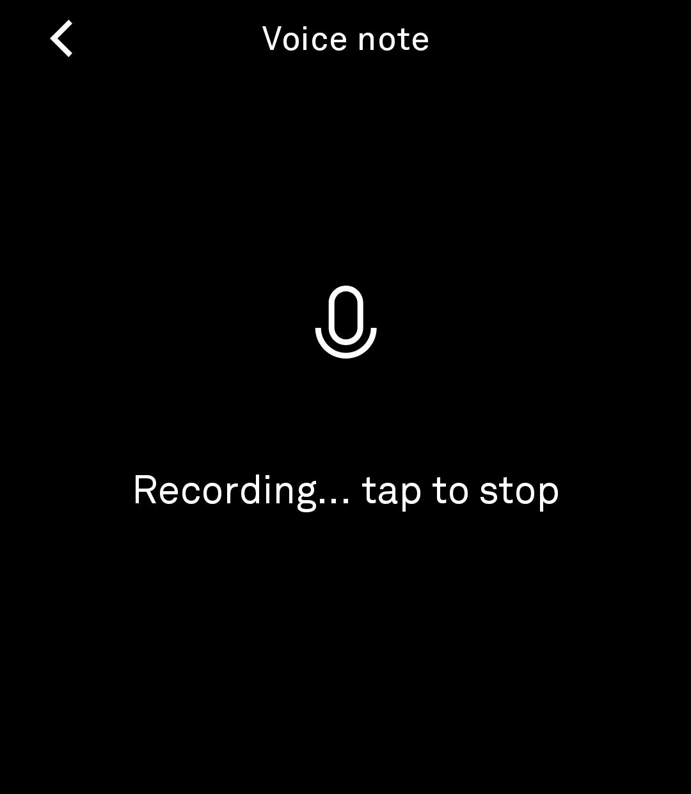

# Chats

*WhatsApp, Instagram, and your other chats on your Light Phone III.*

Chats brings **WhatsApp to your Light Phone III**, along with **Instagram DMs** and other networks, through your Beeper account. Log in once and your existing conversations arrive on the phone in a quiet, text-first interface inspired by the philosophy of Light OS.

Under the hood it runs on **Matrix**, the open, encrypted messaging standard behind Beeper's bridges, so every conversation is end-to-end encrypted. If you'd rather not use Beeper, Chats speaks plain Matrix and works with any Matrix homeserver.

Chats is a **real LightOS tool**: a thin interface built on the Light SDK design system, launched from the LightOS toolbox, packaged as a **single APK** that hosts its own background service — the same thin-UI-over-embedded-service architecture Light's own messaging tool uses, so messages keep arriving and notifying even after the tool closes.

Chats is currently in **beta**. It is suitable for daily use; features and behavior may still evolve before a stable release.

> **Current Status:** Beta
>
> **Current Version:** 0.5.0 (versionCode 50)

---

# Screenshots

The chat list, a 1:1 thread, a group thread, search, the networks panel, settings, and the voice-note recorder on a Light Phone III (monochrome):

<p align="center">
  
  
  
  
  
  
  
</p>

---

# Features

- **WhatsApp, Instagram & more** — your existing chats from Beeper's bridged networks, with a network selector (All / WhatsApp / Instagram) so you can focus on one at a time
- **1:1 and group chats** — a single-line chat list (unread counts, relative timestamps) that reveals more on scroll
- **Search** — find any chat by name from the chat list, with a direct/group mode switch; results respect the selected network
- **Contact overlay** — tap a thread's room name to see the contact's name and network
- **Hardware buttons work** — volume, camera, and the brightness wheel are relayed to the platform, so the native controls behave inside Chats
- **End-to-end encryption** — every conversation is encrypted end to end, with simple emoji-based device verification and recovery-key login for new devices
- **Or a Matrix homeserver of your own** — Chats isn't tied to Beeper; it works with any Matrix homeserver
- **Notifications** — one calm notification per room as messages arrive; a push channel (ntfy) wakes the sync the moment a message arrives, so delivery is instant
- **Voice notes** — record, send, and play (Opus — the standard voice-message format, roughly half the size of the earlier AAC); playback handles the bridge's malformed Ogg streams
- **Photos** — attach via the system photo picker; tap a thumbnail for a full-screen view
- **Message reactions** — shown as small tags under the message
- **Delivery status** — a "delivered" tag on your newest message once it reaches the room, and a "not delivered" marker when it fails
- **Read state** — opening a thread marks it read server-side
- **Day-grouped timestamps** — time-of-day for today, "yesterday", weekday names, then dates
- **Instant re-open** — room list and threads are cached to disk
- **Handles very large accounts** — the conversation list stays reliable even with thousands of rooms; any room that gets a new message surfaces immediately
- **Battery-conscious sync** — with the screen off, sync stretches to a slow idle cadence (push-wake keeps delivery instant); a Settings toggle pauses sync entirely (and the foreground service) when you don't need it
- **Optional Wi-Fi-only media downloads**

---

# Getting Started

## Install on a Light Phone III

Chats is a single-APK app (since 2026-08-19) — the former companion is merged into the tool as a library; the APK hosts its own service and needs no separate install. It is signed with a development key, so it requires the community-ADB sideload route and the most permissive external-tools tier on the device:

1. Enable USB debugging (Settings → Developer options) and install the one APK via `adb install -r`.
2. On the phone, set **Developer options → External tools → "All tools"** (LightOS warns about the security risk — the APK is dev-signed, not Light-signed).
3. Open **Chats** from the toolbox. The connection runs in-process (a `ChatSyncService` keeps sync alive in the background).
4. Log in from Settings with your Beeper account — your WhatsApp and Instagram chats appear automatically.

## Build

From the workspace root, through the memory-guarded wrapper:

```bash
source tools/env.sh
tools/build --dir chats :app:assembleDebug
```

or directly in this directory:

```bash
./gradlew :app:assembleDebug
```

Release builds are minified with R8 and resource-shrunk:

```bash
tools/build --dir chats -Dorg.gradle.jvmargs="-Xmx5g -XX:MaxMetaspaceSize=768m" \
    -Dkotlin.daemon.jvmargs="-Xmx2g" :app:assembleRelease
```

The build consumes `../light-sdk` as an included (composite) build — see `settings.gradle.kts`. The SDK's chat service methods are additive patches carried in the workspace's fork of the SDK (mirrored at `https://github.com/fenleon/light-sdk`).

## Test on the lightos emulator

```bash
tools/emulator.sh                 # boots the AVD (writable-system)
adb root && adb remount
adb install -r chats/app/build/outputs/apk/debug/app-debug.apk
# open the Chats tool from the LightOS toolbox
```

The emulator's dev homeserver (local Synapse, `http://10.0.2.2:8008`) is the standard functional test target — see `docs/SETUP.md` for the recipe.

---

# Architecture

Chats is a native Android application written in Kotlin using Jetpack Compose, packaged as a single APK (since 0.4.0) with two modules:

- **`:app` — the tool** (`com.lightphone.chats`, label "Chats"). A thin, quiet chat UI launched from the LightOS toolbox: chat list, thread, composer, search, settings. All UI is Light SDK design-system primitives, and the tool runtime's restrictions (foreground services, notifications, media APIs, background work) are respected.
- **`:server` — the companion as a library** (`com.lightphone.chats.server`, merged into the same APK). Hosts the SDK's `LightSdkService` and the entire privileged Matrix stack: the Trixnity `MatrixClient` (login, session restore, sync), a Room-based event store, a foreground `ChatSyncService` sync loop, new-message notifications, E2EE (megolm + SAS verification), media handling (photo picker, voice-note recording, media downloads), a background room-list cache, and the push channel.

The tool is a thin UI over the embedded companion's binder: every screen is a request over the SDK's service seam, and the companion does the work. That is why messages keep syncing and notifying after the tool closes.

---

# Privacy & Security

- **End-to-end encryption.** Every conversation is end-to-end encrypted and decrypts only on your verified devices. You verify a new device by comparing emojis, or by entering your recovery key.
- **No analytics, ads, or tracking.**
- **Data lives on your homeserver** — Beeper's or your own. The app stores the message history locally (in its private storage) so rooms re-open instantly and old messages are searchable offline.
- **Notifications** show a message preview, like any messaging app. The app runs a foreground service only while sync is enabled; the sync-pause toggle stops it entirely.
- **Media downloads** can be restricted to Wi-Fi from Settings.

---

# Current Limitations

- WhatsApp and Instagram arrive through Beeper's bridges — an independent, unofficial path, not an official Meta client, and subject to Beeper's service.
- Requires the "All tools" external-tools tier on a real Light Phone III (dev-signed APKs are treated as `Unknown` by LightOS).
- Beeper login uses Beeper's v1 account flow; generic-homeserver login exists in the codebase as dev/test tooling.
- Instant delivery depends on the push channel; without a configured push endpoint, new messages arrive at the next scheduled sync round.
- E2EE key backup restoration is scoped to the logged-in account's session.

---

# Contributing

Contributions, bug reports, feature requests, and suggestions are welcome.

If you encounter a bug, please include:

- Chats version
- Light Phone III software version
- Steps to reproduce
- Expected behavior
- Actual behavior

---

# Frequently Asked Questions

### How do I get WhatsApp on my Light Phone?

Log in to Chats with a Beeper account, and your WhatsApp and Instagram conversations appear automatically — Chats is the client, Beeper supplies the bridge to those networks. No Beeper account? Chats also works with any Matrix homeserver directly.

### Is this an official WhatsApp client?

No. Chats is an independent, unofficial project. WhatsApp and Instagram messages arrive through Beeper's bridge service, which is unaffiliated with Meta.

### Where is my data stored?

Your messages live on your messaging server — Beeper's, or your own Matrix homeserver. The app keeps a local copy of your message history on the phone so rooms re-open instantly and are readable offline. Nothing is uploaded anywhere else.

### Does Chats collect analytics or usage data?

No.

### Is background messaging reliable?

The app runs a foreground service with a persistent sync loop; messages arrive and notify in real time, and a disk cache makes returning to a thread instant. A Settings toggle can pause sync entirely to save battery.

---

# Important

Chats is an independent, unofficial open-source project.

Chats is not affiliated with, endorsed by, sponsored by, or approved by The Light Phone, Inc., Beeper, or Matrix.org.

Light Phone and Light OS are trademarks of The Light Phone, Inc. Other trademarks are the property of their respective owners and are used solely to identify compatibility with third-party products and services.

The Matrix protocol engine is [Trixnity](https://github.com/benkuly/trixnity) (Apache-2.0); the Beeper account-flow bootstrap was adopted (MIT) from the community Beeper4LightOS project.

---

# License

Chats is licensed under the MIT License. See [LICENSE](LICENSE) for the complete license text.
