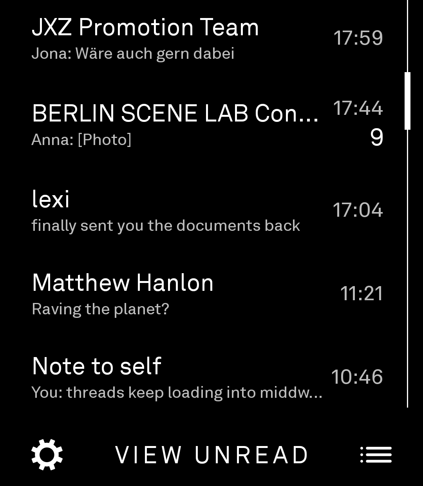
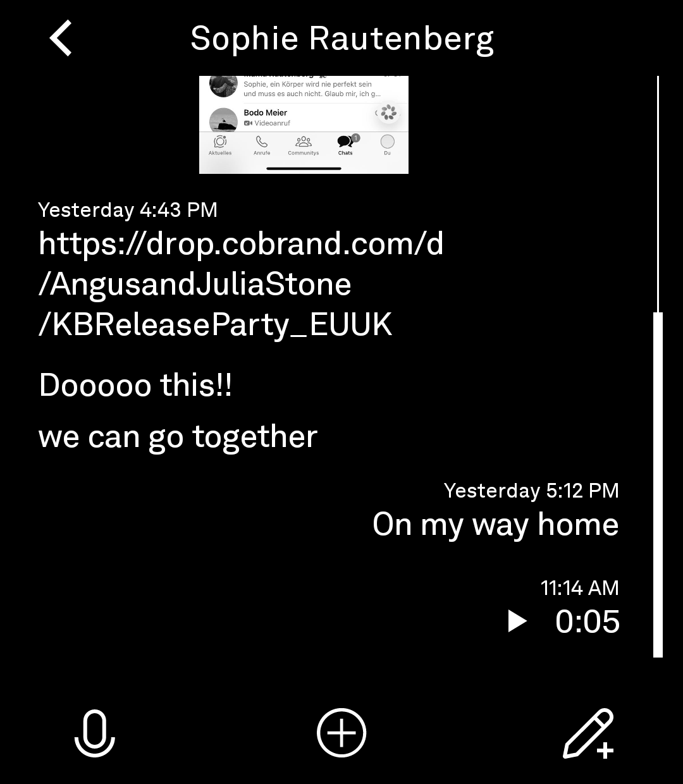
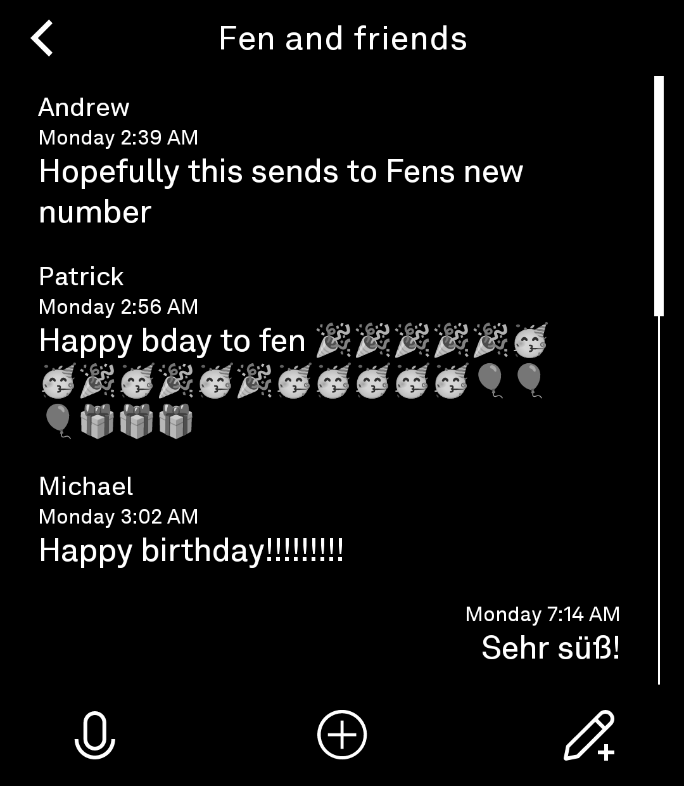
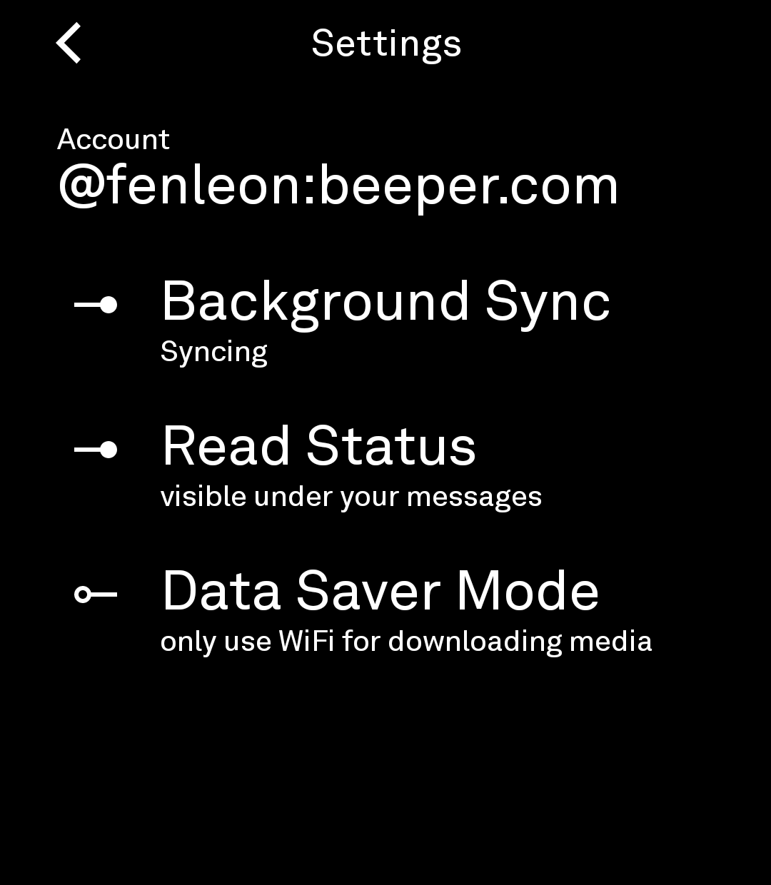

# Chats

*A calm, end-to-end-encrypted Matrix messaging tool for the Light Phone III.*

Chats is a Matrix client built specifically for the Light Phone III. It brings your 1:1 and group chats to the phone in a quiet, text-first interface inspired by the philosophy of Light OS — no ads, no infinite feeds, no noise. Just your conversations.

It works with **Beeper accounts**, so your WhatsApp and Instagram chats arrive through Beeper's bridges, or with a **self-hosted Matrix homeserver**. Conversations are protected with Matrix end-to-end encryption (megolm), with on-device SAS verification and recovery-key login.

Chats is a **real LightOS tool**: a thin interface built on the Light SDK design system, launched from the LightOS toolbox, with a companion app hosting the persistent encrypted connection, storage, and notifications — the same tool + companion architecture Light's own messaging tool uses, so messages keep arriving and notifying even after the tool closes.

Chats is currently in **beta**. It is suitable for daily use; features and behavior may still evolve before a stable release.

> **Current Status:** Beta
>
> **Current Version:** 0.1.0 (versionCode 15)

---

# Screenshots

The chat list, a 1:1 thread, a group thread, and settings on a Light Phone III (light-on-black):

<p align="center">
  
  
  
  
</p>

---

# Features

- **1:1 and group chats** — Matrix rooms, with a single-line chat list (unread counts, relative timestamps) that reveals more on scroll
- **End-to-end encryption** — megolm encrypted conversations, SAS device verification (emoji comparison), and recovery-key login for new devices
- **Beeper accounts** — WhatsApp, Instagram, and other Beeper bridges, with a network selector (All / WhatsApp / Instagram) derived from room tags
- **Or a Matrix homeserver of your own** — the companion speaks plain Matrix
- **Notifications** — one calm notification per room as messages arrive, tap to open the thread
- **Voice notes** — record, send, and play (AAC)
- **Photos** — attach via the system photo picker; tap a thumbnail for a full-screen view
- **Message reactions** — shown as small tags under the message
- **Delivery status** — a "not delivered" marker when a message fails to reach the room
- **Read state** — opening a thread marks it read server-side
- **Day-grouped timestamps** — time-of-day for today, "yesterday", weekday names, then dates
- **Instant re-open** — room list and threads are cached to disk, so returning to a chat is immediate
- **Battery-conscious sync** — a Settings toggle pauses sync entirely (and the foreground service) when you don't need it
- **Optional Wi-Fi-only media downloads**

---

# Getting Started

## Install on a Light Phone III

Chats is a two-APK app — the tool and its companion — signed with a development key, so it requires the community-ADB sideload route and the most permissive external-tools tier on the device:

1. Enable USB debugging (Settings → Developer options) and install both APKs via `adb install -r`.
2. On the phone, set **Developer options → External tools → "All tools"** (LightOS warns about the security risk — the APKs are dev-signed, not Light-signed).
3. Open **Chats** from the toolbox. The companion ("Chats Server") hosts the connection.
4. Log in from Settings with your Beeper account (or a homeserver).

## Build

From the workspace root, through the memory-guarded wrapper:

```bash
source tools/env.sh
tools/build --dir chats :app:assembleDebug :server:assembleDebug
```

or directly in this directory:

```bash
./gradlew :app:assembleDebug :server:assembleDebug
```

Release builds are minified with R8 and resource-shrunk:

```bash
tools/build --dir chats -Dorg.gradle.jvmargs="-Xmx5g -XX:MaxMetaspaceSize=768m" \
    -Dkotlin.daemon.jvmargs="-Xmx2g" :app:assembleRelease :server:assembleRelease
```

The build consumes `../light-sdk` as an included (composite) build — see `settings.gradle.kts`. The SDK's chat service methods are additive patches carried in the workspace's fork of the SDK (mirrored at `https://github.com/fenleon/light-sdk`).

## Test on the lightos emulator

```bash
tools/emulator.sh                 # boots the AVD (writable-system)
adb root && adb remount
adb install -r chats/app/build/outputs/apk/debug/app-debug.apk
adb install -r chats/server/build/outputs/apk/debug/server-debug.apk
# open the Chats tool from the LightOS toolbox
```

The emulator's dev homeserver (local Synapse, `http://10.0.2.2:8008`) is the standard functional test target — see `docs/SETUP.md` for the recipe.

---

# Architecture

Chats is a native Android application written in Kotlin using Jetpack Compose, following the workspace's two-module tool pattern:

- **`:app` — the tool** (`com.lightphone.chats`, label "Chats"). A thin, quiet chat UI launched from the LightOS toolbox: chat list, thread, composer, settings. All UI is Light SDK design-system primitives, and the tool runtime's restrictions (foreground services, notifications, media APIs, background work) are respected.
- **`:server` — the companion** (`com.lightphone.chats.server`). A plain Android app hosting the SDK's `LightSdkService` and the entire privileged Matrix stack: the Trixnity `MatrixClient` (login, session restore, sync), a Room-based event store, a foreground `ChatSyncService` sync loop, new-message notifications, E2EE (megolm + SAS verification), media handling (photo picker, voice-note recording, media downloads), and a background room-list cache.

The tool is a thin UI over the companion's binder: every screen is a request over the SDK's service seam, and the companion does the work. That is why messages keep syncing and notifying after the tool closes.

---

# Privacy & Security

- **End-to-end encryption.** With a Beeper account, conversations are megolm-encrypted and decrypt only on your verified devices. You verify new devices by comparing emojis, or by entering your recovery key.
- **No analytics, ads, or tracking.**
- **Data lives on your homeserver** — Beeper's or your own. The companion stores the message history locally (in its private storage) so rooms re-open instantly and old messages are searchable offline.
- **Notifications** show a message preview, like any messaging app. The companion runs a foreground service only while sync is enabled; the sync-pause toggle stops it entirely.
- **Media downloads** can be restricted to Wi-Fi from Settings.

---

# Current Limitations

- Requires the "All tools" external-tools tier on a real Light Phone III (dev-signed APKs are treated as `Unknown` by LightOS).
- Beeper login uses Beeper's v1 account flow; generic-homeserver login exists in the codebase as dev/test tooling.
- With a very active account (many live bridge rooms), background sync costs measurable battery — the sync-pause toggle is the escape hatch.
- E2EE key backup restoration is scoped to the logged-in account's session.

---

# Contributing

Contributions, bug reports, feature requests, and suggestions are welcome.

If you encounter a bug, please include:

- Chats version
- Light Phone III software version
- Steps to reproduce
- Expected behavior
- Actual behavior

---

# Frequently Asked Questions

### Does Chats require a Beeper account?

No — it speaks Matrix. Beeper accounts are the primary supported path (they bring WhatsApp and Instagram through Beeper's bridges), but any Matrix homeserver can be used.

### Is my data stored anywhere besides my homeserver?

The companion keeps a local copy of your message history on the phone so rooms re-open instantly and are readable offline. Nothing is uploaded anywhere else.

### Does Chats collect analytics or usage data?

No.

### Is background messaging reliable?

The companion runs a foreground service with a persistent sync loop; messages arrive and notify in real time, and a disk cache makes returning to a thread instant. A Settings toggle can pause sync entirely to save battery.

---

# Important

Chats is an independent, unofficial open-source project.

Chats is not affiliated with, endorsed by, sponsored by, or approved by The Light Phone, Inc., Beeper, or Matrix.org.

Light Phone and Light OS are trademarks of The Light Phone, Inc. Other trademarks are the property of their respective owners and are used solely to identify compatibility with third-party products and services.

The Matrix protocol engine is [Trixnity](https://github.com/benkuly/trixnity) (Apache-2.0); the Beeper account-flow bootstrap was adopted (MIT) from the community Beeper4LightOS project.

---

# License

Chats is licensed under the MIT License. See [LICENSE](LICENSE) for the complete license text.
