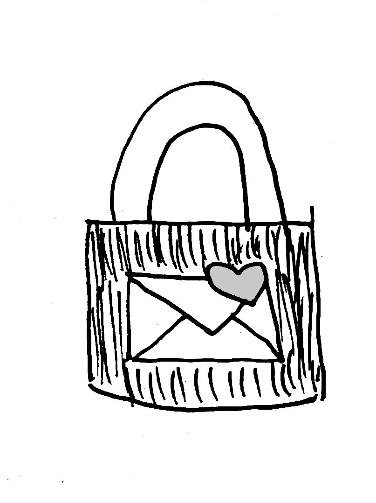

<p align="center">
  <picture>
    <source media="(prefers-color-scheme: dark)" srcset="art/wordmark-alpha-white.png">
    
  </picture>
</p>
<p align="center">
  All your Chats, finally, on the Light Phone III.
</p>
<p align="center"><a href="https://ko-fi.com/fenleon">
  <picture><source media="(prefers-color-scheme: dark)" srcset="art/coffee-hand-filled-alpha-white-steam.png"></picture>
  <picture><source media="(prefers-color-scheme: dark)" srcset="art/buy-me-a-coffee-alpha-white.png"></picture>
  </a></p>


# Chats
A messaging tool for the Light Phone III. Connects all your chats, WhatsApp, Signal, Telegram, and more into one quiet, text-first interface. Log in with a [Beeper](https://beeper.com) account or a Matrix homeserver. Everything is end-to-end encrypted.

<p align="center">
  <picture>
    <source media="(prefers-color-scheme: dark)" srcset="art/bubbles-line-alpha-white.png">
    
  </picture>
</p>

## Features

- Connect to all your **Networks** through your Beeper account: WhatsApp, Instagram, Telegram, Signal, Messenger, X, Google Messages (SMS/RCS), Google Chat, Google Voice, LinkedIn, Discord, Slack
- 1:1 and group chats, with archive, pin, mute, search, reactions, delivery status support
- Messages sync while Chats is open; the phone stays fully quiet when you close it
- Voice-note playback
- End-to-end encrypted, with device verification

This `main` branch is the LightOS **Tool Library** build: a single scanned tool
module, buildable by Light's own pipeline. Background sync, notifications, and
photo/voice-note *sending* are planned follow-ups (see *Branches* below).

## Install

Until Chats is available in the Tool Library, installs go through the sideload route. The APK is signed with a development key, so it needs the community-ADB sideload route and the most permissive external-tools tier on the phone:

1. Download the latest APK from [Releases](https://github.com/fenleon/chats/releases/latest)
2. Enable USB debugging (Settings → Developer options) and install it: `adb install -r app-release.apk`
3. Set Developer options → External tools → **All tools**
4. Open Chats from the toolbox and log in with your Beeper account from Settings

<p align="center">
  <picture>
    <source media="(prefers-color-scheme: dark)" srcset="art/padlock-line-alpha-white.png">
  
  </picture>
</p>

## Build

```bash
tools/build --dir chats :tool:assembleDebug      # from the workspace root
tools/build --dir chats :tool:assembleRelease    # release (R8-minified)
```

The build consumes `../light-sdk` as a composite build; the SDK's chat service methods are additive patches carried in the workspace's fork of the SDK.

## Branches & releases

- **`main`** — the Light-built release line: the stripped Tool Library build (this README). Sync runs while the app is open; notifications and photo/voice-note sending are planned follow-ups.
- **`dev`** — the full-featured development build for sideloading: background sync, notifications, photo/voice-note sending.

Both are released together when an update affects them, under one shared, increasing version code. Which build you have is easiest to tell by behavior (notifications on = `dev`).

## Limitations

- Bridged networks (WhatsApp, Instagram, ...) arrive through Beeper, an unofficial path, not an official Meta client.
- Requires the **All tools** external-tools tier on a real Light Phone III (dev-signed APKs are treated as unknown by LightOS).
- On `main`, messages arrive only while Chats is open (screen on); there are no notifications and no photo/voice-note sending yet.

## Legal

Chats is an independent, unofficial open-source project, not affiliated with or endorsed by The Light Phone, Inc., or Beeper. The Matrix protocol engine is [Trixnity](https://github.com/benkuly/trixnity) (Apache-2.0). Licensed under the [MIT License](LICENSE).

<p align="center">
  <picture>
    <source media="(prefers-color-scheme: dark)" srcset="art/so-many-chats-alpha-white.png">
    
  </picture>
</p>

<p align="center">Support my work by leaving me a <a href="https://ko-fi.com/fenleon">tip</a> or  <a href=https://github.com/sponsors/fenleon">sponsoring me</a>. A little goes a long way.</p>
